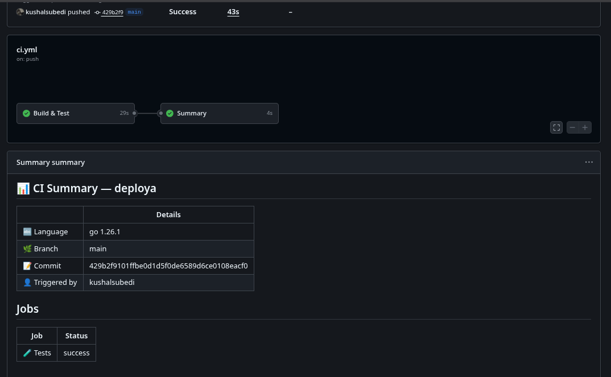
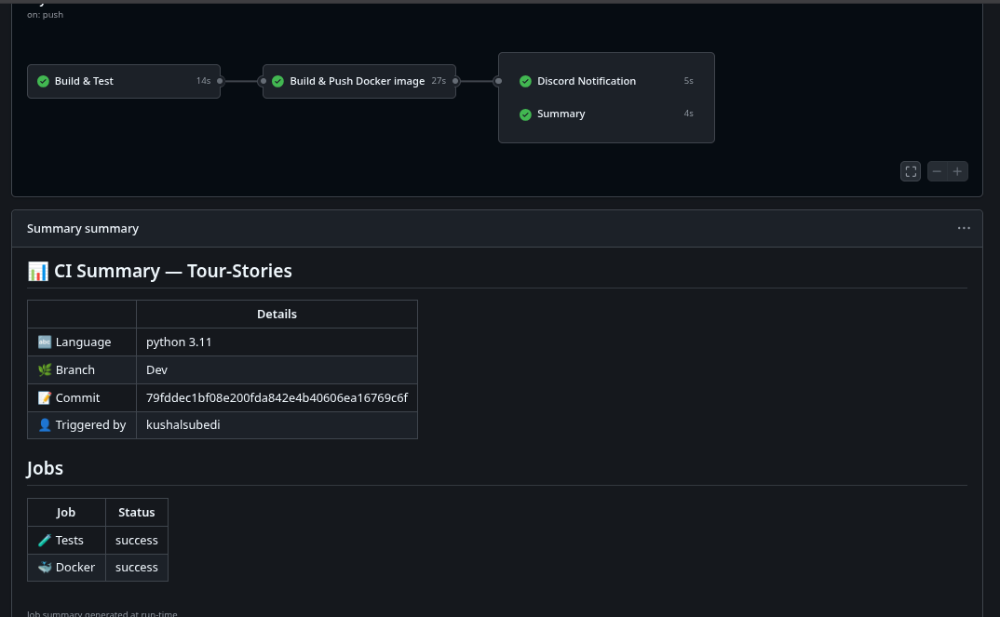

# Hi, this is Deploya!

## What it does?
- It generates a `ci.yml` file that will get triggered on push or PR on main branch
- It will generate basic jobs like test, build, notification to your corporate messaging app (e.g. Slack, Discord, or your boss's email if required)
- Generates a build summary of CI runs
- Generates Release pipeline for your product semantic github release

## Why?
Because we hate creating `ci.yml` and sometimes a basic one will also work. Yet it can be upgraded to handle some repetitive tasks.


## How to run
```bash
go build .
# it will create deploya binary and you can run it with
deploya init
# or
go run main.go init
```

## What can it do?
It can detect some popular languages like Python, Go, JS/TS (Node), Java, Rust, Ruby based upon the directory and the files they have.

**Example:** it detects Python by looking into `pyproject.toml` or `requirements.txt` like files, and Go from `go.mod` file.

## How it works
1. Detects programming language
2. Asks user if they need webhook integration or not for messaging
3. Asks user if they are using any container registry — only available if the project has a visible `Dockerfile`
4. Creates `ci.yml`

## What can be added?
A lot of things.. will update about it later.

## Example 




## generated CI file for a python project
```yaml 
name: CI — your-repo-name

on:
  push:
    branches: [ "main" ]
  pull_request:
    branches: [ "main" ]

env:
  IMAGE_NAME: your-image-name

jobs:

  # ── Build & Test ────────────────────────────────────────────────
  test:
    name: Build & Test
    runs-on: ubuntu-latest

    steps:
      - name: Checkout code
        uses: actions/checkout@v4

      
      - name: Set up Python 3.11
        uses: actions/setup-python@v5
        with:
          python-version: "3.11"

      - name: Install dependencies
        run: |
          python -m pip install --upgrade pip
          pip install -r requirements.txt
          

      

      
    #   - name: Run tests
    #     run: pytest
      

  
  # ── Docker Build & Push ───────────────────────────────────────────
  docker:
    name: Build & Push Docker image
    runs-on: ubuntu-latest
    needs: test

    steps:
      - name: Checkout code
        uses: actions/checkout@v4

      - name: Set up Docker Buildx
        uses: docker/setup-buildx-action@v3

      
      - name: Log in to GHCR
        uses: docker/login-action@v3
        with:
          registry: ghcr.io
          username: ${{ github.actor }}
          password: ${{ secrets.GITHUB_TOKEN }}

      - name: Build and push to GHCR
        uses: docker/build-push-action@v5
        with:
          context: .
          push: ${{ github.ref == 'refs/heads/main' }}
          tags: ghcr.io/${{ github.repository_owner }}/${{ env.IMAGE_NAME }}:${{ github.sha }}
          cache-from: type=gha
          cache-to: type=gha,mode=max

      
  

  # ── Notify ────────────────────────────────────────────────────────
  
  notify:
    name: Discord Notification
    runs-on: ubuntu-latest
    needs: [test, docker]
    if: always()

    steps:
      - name: Notify Discord
        uses: tsickert/discord-webhook@v6.0.0
        with:
          webhook-url: ${{ secrets.DISCORD_WEBHOOK_URL }}
          embed-title: "${{ needs.test.result == 'success' && '✅ Pipeline Passed' || '❌ Pipeline Failed' }} — Tour-Stories"
          embed-color: "${{ needs.test.result == 'success' && '3066993' || '15158332' }}"
          embed-description: |
            **Repository** : Tour-Stories
            **Branch**     : ${{ github.ref_name }}
            **Language**   : python 3.11
            **Triggered by**: ${{ github.actor }}
            **Commit**     : ${{ github.sha }}
            **Tests**      : ${{ needs.test.result }}
            **Docker**     : ${{ needs.docker.result }}

            [🔗 View Run](${{ github.server_url }}/${{ github.repository }}/actions/runs/${{ github.run_id }})

  

  # ── Summary ───────────────────────────────────────────────────────
  summary:
    name: Summary
    runs-on: ubuntu-latest
    needs: [test, docker]
    if: always()

    steps:
      - name: Pipeline summary
        run: |
          echo "## 📊 CI Summary — Tour-Stories" >> $GITHUB_STEP_SUMMARY
          echo "" >> $GITHUB_STEP_SUMMARY
          echo "| | Details |" >> $GITHUB_STEP_SUMMARY
          echo "|---|---|" >> $GITHUB_STEP_SUMMARY
          echo "| 🔤 Language | python 3.11 |" >> $GITHUB_STEP_SUMMARY
          echo "| 🌿 Branch | ${{ github.ref_name }} |" >> $GITHUB_STEP_SUMMARY
          echo "| 📝 Commit | ${{ github.sha }} |" >> $GITHUB_STEP_SUMMARY
          echo "| 👤 Triggered by | ${{ github.actor }} |" >> $GITHUB_STEP_SUMMARY
          echo "" >> $GITHUB_STEP_SUMMARY
          echo "## Jobs" >> $GITHUB_STEP_SUMMARY
          echo "| Job | Status |" >> $GITHUB_STEP_SUMMARY
          echo "|-----|--------|" >> $GITHUB_STEP_SUMMARY
          echo "| 🧪 Tests | ${{ needs.test.result }} |" >> $GITHUB_STEP_SUMMARY
          echo "| 🐳 Docker | ${{ needs.docker.result }} |" >> $GITHUB_STEP_SUMMARY
          
```

# If you want to generate release without any pain 
Create a `.releaserc` file in your working directory with following Basic config and let `deploya init` do the job for you !!

```yaml
on_branch: main # on which branch you want release to take place 
from_branch: dev # this might not be needed as the product is under development
current_version: 0.1.1 # your current release version or github tag, if it is initial keep it `0.0.0`
tag_prefix: v # tag prefix eg: v0.0.1, or whatever prefix you want 
archive: true # this is not needed, but this tool hasn't release it's first major so keep it until v1.0.0 of deploya 
registry: ghcr # this is optional and feature is yet to come 
github_repo: kushalsubedi/deploya # your github repo 
categories:
# release types and commit typos 
  features: [feat, feature]
  fixes: [fix, bugfix, bug]
  patches: [chore, refactor, perf, improvement]
  docs: [docs, doc]
```

[](https://www.star-history.com/?repos=kushalsubedi%2Fdeploya&type=date&legend=top-left)